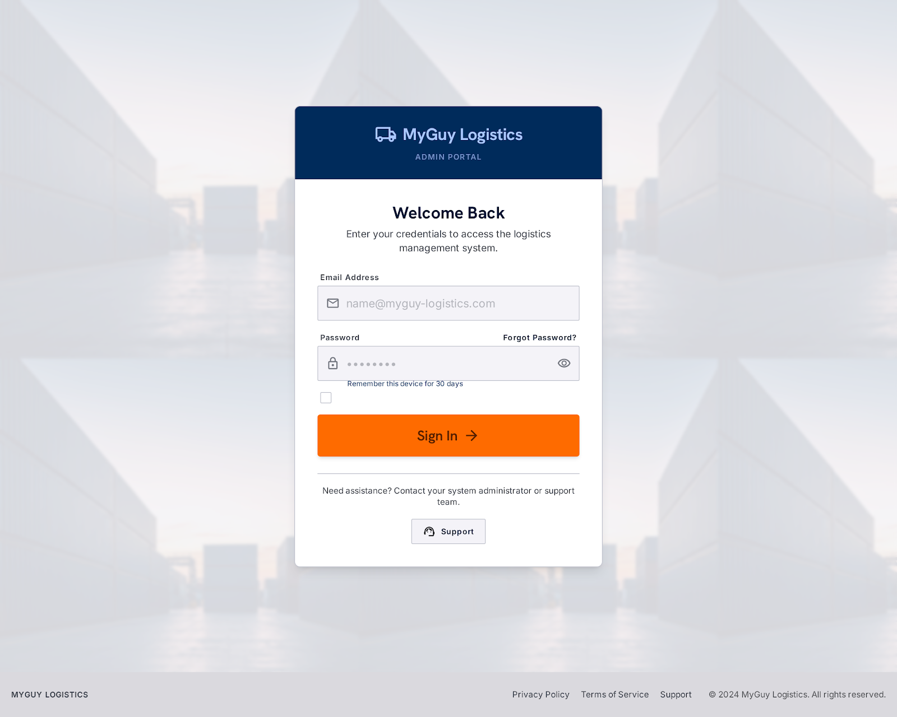

<p align="center">
  
</p>

<h1 align="center">MyGuy Logistics — Admin Dashboard</h1>

<p align="center">
  A responsive React + TypeScript admin console for managing a vendor-and-rider delivery operation: orders, vendors, riders, and finance, all in one system.
</p>

<p align="center">
  
  
  
  
</p>

---

## Contents

- [About](#about)
- [Screenshot](#screenshot)
- [Features & Routes](#features--routes)
- [Tech Stack](#tech-stack)
- [Project Structure](#project-structure)
- [Getting Started](#getting-started)
- [Roadmap](#roadmap)
- [Contributing](#contributing)
- [License](#license)

## About

**MyGuy Logistics** is an operations dashboard built for a delivery marketplace connecting vendors (food, fashion, beauty) with a fleet of independent riders. This repository contains the **admin-facing frontend**: the internal tool an operations team uses to monitor orders in real time, manage vendor accounts, track rider fleet performance, and review financial activity.

The interface is built mobile-first, with a bottom tab navigation pattern for smaller screens and a full desktop layout for operations staff working at a desk.

> **Status:** UI prototype. The dashboard currently runs on structured mock data to demonstrate the full admin experience end-to-end. It is not yet wired to a live backend/API — see [Roadmap](#roadmap).

## Screenshot

<p align="center">
  
</p>

## Features & Routes

The dashboard shares a common `AdminShell` layout (system top bar + route picker on desktop, bottom tab bar on mobile) across all authenticated pages.

| Page | Route | What it does |
|---|---|---|
| Login | `/` | Admin authentication with client-side validation |
| Overview | `/overview`, `/orders`, `/dashboard` | Daily revenue, order volume, dispatch acceptance rate, and average delivery time, with a revenue trend chart and an order table filterable by all / in-progress / delivered / flagged issues |
| Vendors | `/vendors` | Registry of onboarded vendors — tier plan (Premium/Standard/Basic), weekly orders and revenue, ratings, and account status (active / pending deposit) |
| Riders | `/riders` | Fleet visibility across vehicle type, trips completed today, acceptance rate, average delivery latency, and online/offline status |
| Finance | `/finance` | GMV, platform revenue, pending payouts, and runway tracking, with a revenue mix breakdown (subscriptions / delivery margin / B2B) and a live transaction ledger |
| Forgot Password | `/forgot-password` | Password recovery flow |
| Support | `/support` | Support center |
| Privacy Policy | `/privacy-policy` | Privacy policy |
| Terms of Service | `/terms-of-service` | Terms of service |

## Tech Stack

| Layer | Technology |
|---|---|
| UI | React 19 |
| Language | TypeScript |
| Build tool | Vite 8 |
| Routing | React Router 7 |
| Charts | Recharts |
| Linting | ESLint 10 (flat config) + typescript-eslint |

## Project Structure

```
src/
├── App.tsx                  # Route definitions
├── main.tsx                 # App entry point
├── Pages/
│   ├── Overview.tsx          # Orders & KPI dashboard
│   ├── Vendors.tsx           # Vendor registry & management
│   ├── Riders.tsx            # Rider fleet tracking
│   ├── Finance.tsx           # Revenue, payouts & ledger
│   ├── Login.tsx             # Admin authentication
│   ├── ForgotPassword.tsx
│   ├── Support.tsx
│   ├── TermsOfService.tsx
│   ├── PrivacyPolicy.tsx
│   └── Component/
│       ├── AdminShell.tsx    # Shared page layout + mobile nav
│       ├── SystemTopBar.tsx  # Top bar with route picker
│       ├── MyButton.tsx
│       └── navigation.ts     # Nav item + icon definitions
└── assets/
```

## Getting Started

### Prerequisites

- [Node.js](https://nodejs.org/) 18+ and npm

### Installation

```bash
git clone https://github.com/<your-username>/myguyproject.git
cd myguyproject
npm install
```

### Development

```bash
npm run dev
```

The app will be available at `http://localhost:5173`.

### Build

```bash
npm run build
```

Compiles TypeScript and produces an optimized production build in `dist/`.

### Preview production build

```bash
npm run preview
```

### Lint

```bash
npm run lint
```

## Roadmap

- [ ] Connect to a live backend/API (auth, orders, vendors, riders, finance data)
- [ ] Real-time order updates (WebSocket or polling)
- [ ] Role-based access control for admin accounts
- [ ] Rider assignment / dispatch actions from the Riders view
- [ ] Vendor onboarding and approval workflow

## Contributing

Contributions are welcome — bug fixes, features, docs, and refactors. See [CONTRIBUTING.md](./CONTRIBUTING.md) for setup steps, coding conventions, and the pull request process. For larger changes, please open an issue first to discuss the approach.

## License

Licensed under the [MIT License](./LICENSE).
